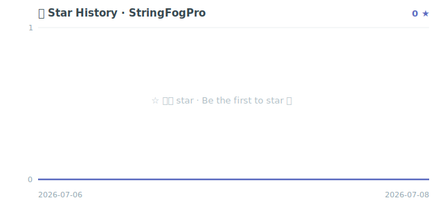

<div align="center">


<br/>


<br/><br/>


[](https://github.com/Pangu-Immortal/StringFogPro/stargazers)

**如果对你有帮助，点个 Star ⭐ 支持一下 · If it helps, a Star means a lot**

简体中文 | [English](README_EN.md)

</div>

---

## TL;DR

**StringFogPro** 是一款自动加密 APK / AAR 中 Java·Kotlin 字符串字面量的 **Gradle 字符串加密插件**：构建期把明文替换为「密文 + 运行时解密调用」，反编译只看到乱码，让硬编码的接口地址、密钥、Token 不再裸奔。它在经典 [StringFog](https://github.com/MegatronKing/StringFog)（Apache-2.0）基础上做**现代化超集升级**——拥抱 **AGP 8.7 / 9.2** 现代插桩 API（`AsmClassVisitorFactory` + `onVariants`），**内置 AES**（原版 v3.0.0 已删除），提供 **XOR / AES / 自定义算法**三选一，新增 **每串随机密钥**、**bytes 免 Base64 模式**、**明文→密文映射文件**，支持**按包 include/exclude + 最小串长阈值**配置。运行时是**零依赖纯 Java JAR**，一次 `./gradlew assembleRelease` 全自动完成、零侵入业务代码。**34/34 测试通过 + 真实 APK/AAR 反编译证据 + AGP 8.7/9.2 双档实测。** 适用于 Android APK/AAR/库的字符串混淆、密钥保护、反逆向加固。

## 目录

- [核心特性](#核心特性)
- [快速接入](#快速接入)
- [配置项参考](#配置项参考)
- [相对原版 StringFog 的升级](#相对原版-stringfog-的升级)
- [真实反编译证据](#真实反编译证据)
- [算法自主扩展](#算法自主扩展)
- [适配测试矩阵](#适配测试矩阵)
- [版本支持表](#版本支持表)
- [工程结构](#工程结构)
- [设计说明与已知边界](#设计说明与已知边界)
- [Roadmap（诚实标注）](#roadmap诚实标注)
- [更新日志](#更新日志)
- [致谢与 License](#致谢与-license)

## 核心特性

| 特性 | 说明 |
| --- | --- |
| **Java / Kotlin 双支持** | 工作在 ASM 字节码层，与源语言无关，两者被同样加密（附真实反编译证据） |
| **拼接字面量加密（v2.2.0）** | 支持 `invokedynamic makeConcatWithConstants`（Java 9+/Kotlin 的 `"文本"+变量`/字符串模板）——去糖为等价 `StringBuilder` 链，加密 recipe/bootstrap 常量里的明文（旧版仅 LDC 够不着） |
| **APK + AAR/JAR 加密** | Application 变体与 Library 变体走同一套 ASM 变换核心 |
| **三种算法** | 内置 **XOR+Base64（默认）** 与 **AES-128/CBC**，可注册任意自定义 `IStringFog` |
| **每串随机密钥** | 每个字符串独立随机密钥，相同明文各处密文不同，抗统计/模式分析 |
| **bytes 免 Base64** | 密文以原始 `byte[]` 字面量发射（d8 优化为 `fill-array-data`），抹除 Base64 静态特征 |
| **映射文件** | 可选输出「类#方法 · 算法 · 明文→密文」映射，便于审计与排查 |
| **细粒度配置** | 总开关 + 按包白/黑名单 + `minLength` 阈值 + 配置校验/冲突告警 |
| **完全自动化** | `onVariants` 自动注册，仅 apply 插件；仅 release 插桩，debug 保持明文 |
| **零依赖运行时** | 纯 Java JAR，仅依赖 JDK，POM 零依赖，不引入 kotlin-stdlib |
| **向后兼容** | 零配置默认路径与 v1.1.0 逐字节等价，历史工程零成本迁移 |

## 快速接入

StringFogPro 通过 JitPack 发布两个坐标：插件 `stringfog-gradle-plugin` 与运行时 `stringfog`。

### 第 1 步：声明 JitPack 仓库

`settings.gradle.kts`：

```kotlin
pluginManagement {
    repositories {
        maven { url = uri("https://jitpack.io") }
        google(); mavenCentral(); gradlePluginPortal()
    }
}
dependencyResolutionManagement {
    repositories {
        maven { url = uri("https://jitpack.io") }
        google(); mavenCentral()
    }
}
```

### 第 2 步：引入插件（推荐方式 A，JitPack 最稳）

根 `build.gradle.kts` 用 buildscript classpath：

```kotlin
buildscript {
    repositories {
        maven { url = uri("https://jitpack.io") }
        google(); mavenCentral()
    }
    dependencies {
        classpath("com.github.Pangu-Immortal.StringFogPro:stringfog-gradle-plugin:v2.2.0")
    }
}
```

> **方式 B（声明式 `plugins {}`）**：JitPack 服务 module 坐标但不服务插件 marker，需在 `pluginManagement` 加 `resolutionStrategy` 映射：
> ```kotlin
> pluginManagement {
>     resolutionStrategy {
>         eachPlugin {
>             if (requested.id.id == "com.va.stringfog") {
>                 useModule("com.github.Pangu-Immortal.StringFogPro:stringfog-gradle-plugin:${requested.version}")
>             }
>         }
>     }
> }
> ```
> 之后即可 `plugins { id("com.va.stringfog") version "v2.2.0" }`（已实测该 module 坐标可解析装载）。

### 第 3 步：应用插件 + 引入运行时 + 配置

`app/build.gradle.kts`：

```kotlin
plugins {
    id("com.android.application")
    // 或用方式 A：apply(plugin = "com.va.stringfog")
}

dependencies {
    // 运行时解密器（零依赖纯 Java JAR）
    implementation("com.github.Pangu-Immortal.StringFogPro:stringfog:v2.2.0")
}

// 可选配置；不写则零配置走默认 XOR（向后兼容 v1.1.0）
stringfog {
    enabled.set(true)
    algorithm.set("xor")                 // "xor" | "aes" | 自定义 IStringFog 全限定类名
    // key.set("your-release-key")       // 不设则 xor 用默认密钥、aes 用内置默认密钥
    minLength.set(1)
    // bytesMode.set(true)               // 密文以 byte[] 发射，免 Base64
    // randomKeyPerString.set(true)      // 每串独立随机密钥
    // mappingEnabled.set(true)          // 输出 build/outputs/stringfog/ 映射文件
    // fogPackages.add("com.your.app")            // 只加密这些包（留空=全部）
    // excludePackages.add("com.your.app.model")  // 排除这些包（优先级更高）
}
```

**搞定。** 执行 `./gradlew assembleRelease`，release 产物里的字符串即被自动加密；debug 不受影响。

> 全局临时关闭：`./gradlew assembleRelease -Pva.stringfog.enabled=false`

## 配置项参考

`stringfog { }`（`com.vapro.vae.stringfog.plugin.StringFogExtension`）：

| 配置项 | 类型 | 默认值 | 说明 |
| --- | --- | --- | --- |
| `enabled` | `Boolean` | `true` | 总开关；亦可 `-Pva.stringfog.enabled=false` 全局关 |
| `algorithm` | `String` | `"xor"` | `xor` / `aes` / 自定义 `IStringFog` 全限定类名 |
| `key` | `String` | 内置默认 | 密钥；未设时 xor 走 `DEFAULT_KEY`（兼容 v1.1.0），aes 走内置默认密钥 |
| `fogPackages` | `List<String>` | `[]` | 仅加密这些包前缀下的类（为空=全部） |
| `excludePackages` | `List<String>` | `[]` | 排除这些包前缀下的类（优先级高于 `fogPackages`） |
| `minLength` | `Int` | `1` | 最小加密串长阈值，短于此长度保持明文 |
| `bytesMode` | `Boolean` | `false` | 密文以原始 `byte[]` 字面量发射（免 Base64） |
| `randomKeyPerString` | `Boolean` | `false` | 每个字符串独立随机密钥（抗统计分析） |
| `randomKeyLength` | `Int` | `16` | 每串随机密钥长度（字符数，仅 `randomKeyPerString` 生效） |
| `mappingEnabled` | `Boolean` | `false` | 输出映射到 `build/outputs/stringfog/stringfog-mapping-<variant>.txt` |

**配置健壮性**：`minLength` 为负 / `algorithm` 空白 / `randomKeyLength` 非正 → **抛错早失败**；`fogPackages ∩ excludePackages` 重叠、aes/自定义算法未设 key → **告警不阻塞**。

## 相对原版 StringFog 的升级

| 维度 | 原版 StringFog（5.x） | StringFogPro v2.2.0 | 实现 |
| --- | --- | --- | :---: |
| AGP 基线 | AGP 8.x / Gradle 8 | **AGP 8.7 与 9.2 双档实测** | ✅ |
| AES 算法 | v3.0.0 起**已删除** | **内置回归**（AES-128/CBC/PKCS5，随机 IV） | ✅ |
| 排除包 exclude | v1.4.0 起**已移除** | **重新提供** `excludePackages` | ✅ |
| 最小串长阈值 | 无 | 新增 `minLength` | ✅ |
| 每串随机密钥 | ✅ | `RandomKeyGenerator` 已实现 | ✅ |
| bytes 免 Base64 | ✅ | byte[] 字面量 / `fill-array-data` 已实现 | ✅ |
| mapping 映射文件 | ✅ | 构建期明文→密文映射已实现 | ✅ |
| 配置形态 | Groovy DSL 为主 | 类型化 **Kotlin DSL** + 配置校验 | ✅ |
| 运行时依赖 | 需引算法库 | **零依赖纯 Java JAR** | ✅ |

> **诚实声明**：与原版的真正差距收敛到「`plugins {}` 免接线声明式解析」——它需把插件 marker 发布到 Gradle Plugin Portal（需外部发布账号，本项目暂无）。JitPack 下用 buildscript classpath 或 `resolutionStrategy` 映射即可（见[快速接入](#快速接入)）。
>
> bytes 模式「省体积」诚实说明：本仓 6 条短串样例整包 DEX 差异仅 +8 字节（可忽略），故 bytes 模式**首要价值是抹除 Base64 文本特征 + 免运行时 Base64 解码**，而非对短串省体积。

## 真实反编译证据

以下均来自本仓 `sample/` 模块 **v2.1.0 真实构建产物**的 `dexdump` / `javap` 反编译（`build-tools 36.0.0`），非虚构。debug 不插桩（release-only），故 debug DEX 即「加密前」，release DEX 即「加密后」。

**① Java 加密后（release DEX，默认 XOR，单参路径）**

```smali
# JavaSecrets.apiToken() —— release DEX
const-string v0, "CVJjayoOcl0bDRMnFCUtay4UfxNYbAZGfHlrXjsTC1cfXw=="
invoke-static {v0}, Lcom/vapro/vae/stringfog/StringFogRuntime;.decrypt:(Ljava/lang/String;)Ljava/lang/String;
# 明文 "sk-JAVA-PLAINTEXT-..." 在 release DEX 计数=0（消失）；debug=1
```

**② AES 模式（`-Psf.algo=aes -Psf.key=my-release-key-2026`，三参路径）**

```smali
const-string v0, "my-release-key-2026"
const-string v1, "aes"
const-string v2, "DkySB3hkRyzW6kHRx6VGwjISWgTY+L+oaRDZ1qGGh7e/R0V9IJoX9Ny/xEOoRt5ik7jOjFJWwwOhz8hcEr+FJQ=="
invoke-static {v2, v0, v1}, L…/StringFogRuntime;.decrypt:(3×String)String
```

**③ 每串随机密钥（`-Psf.randomKey=true`）** —— 每串一个随机 16 位密钥（6 串实测 6 个互异密钥）：

```smali
const-string v0, "xni1fX647FTX3nn9"       # 该串专属随机密钥
const-string v1, "xor"
const-string v2, "CwVEeycOdxlnChURfTorYSxDWANVbAMCAH5taFIMDV0dCA=="
invoke-static {v2, v0, v1}, L…/StringFogRuntime;.decrypt:(3×String)String
```

**④ bytes 模式（`-Psf.bytes=true`）** —— 无 Base64 文本，密文以 `fill-array-data` 存储：

```smali
new-array v0, v0, [B
fill-array-data v0, 0000000c
invoke-static {v0}, L…/StringFogRuntime;.decrypt:([B)Ljava/lang/String;
```

**⑤ AAR 库端到端（`sample/lib` → `classes.jar` → `javap -c`）** —— 库字符串同样被加密：

```text
# LibJavaSecrets.libApiToken() —— AAR classes.jar
0: ldc           #35    // String CVJjbSIaHjoKFxNDCj0pejRtC3k/dVIROWwzDDkVDVVLC30VXm4=
2: invokestatic  #33    // Method .../StringFogRuntime.decrypt:(String)String
# classes.jar 内 4 条库明文 grep 计数均=0
```

> **复现**：根 `./gradlew publishToMavenLocal` → `./gradlew -p sample :app:assembleDebug :app:assembleRelease :lib:assembleRelease`（各模式加 `-Psf.*`）→ `dexdump -d`（APK）/ `javap -c`（AAR）对比即得。

## 算法自主扩展

实现 `IStringFog`（构建期加密与运行时解密的唯一契约），构建期用 DSL 指定全限定类名、运行时以同名 id 注册。

```java
// 1) 实现算法（放在 buildscript classpath 与 App 都能看到的位置）
package com.your.app.crypto;
import com.vapro.vae.stringfog.IStringFog;

public final class MyFog implements IStringFog {
    @Override public byte[] encrypt(byte[] data, byte[] key) { return transform(data, key); }
    @Override public byte[] decrypt(byte[] data, byte[] key) { return transform(data, key); }
    private byte[] transform(byte[] d, byte[] k) { /* ... */ return d; }
}
```

```kotlin
// 2) 构建期指定（需 public 无参构造，构建期反射构造）
stringfog { algorithm.set("com.your.app.crypto.MyFog") }
```

```java
// 3) 运行时注册（App 早期，如 Application.onCreate）
StringFogRuntime.register("com.your.app.crypto.MyFog", new com.your.app.crypto.MyFog());
```

内置 `xor` / `aes` 已默认注册，无需手动 register。

## 适配测试矩阵

> 全部为**可复现的真实证据**：`./gradlew test`（24 单测/集成）、真实 APK/AAR 反编译、AGP 8.7 与 9.2 双档真实构建。**声明=测试，未测的诚实标注。**

**`./gradlew test` 汇总：24 / 24 通过（0 失败 0 错误）** —— `stringfog` 11 + `stringfog-gradle-plugin` 13。

| 维度 | 结果 | 证据 |
| --- | :---: | --- |
| **AGP 9.2.1 + Gradle 9.6 + JDK 21 + compileSdk 36** | ✅ 实测 | `sample/` 真实 APK+AAR 反编译 |
| **AGP 8.7.3 + Gradle 8.13 + JDK 21 + compileSdk 35** | ✅ 实测 | `sample-agp8/` 真实 APK：release 明文=0，debug=1 |
| Java @ APK / Kotlin @ APK | ✅ | `sample/app` release DEX 明文计数=0 |
| Java @ AAR / Kotlin @ AAR | ✅ | `sample/lib` `classes.jar` javap 反编译，明文=0 |
| XOR / AES / 每串随机密钥 / bytes 往返 | ✅ | `StringFogRuntimeTest` + `StringFogTransformTest` |
| v1.1.0 逐字节向后兼容 | ✅ | `backwardCompatWithV110` |
| AGP 7.2 ~ 8.6 | ⚠️ 未逐版实测 | API 自 AGP 7.2 稳定，理论兼容 |
| JDK 17（下限） | ⚠️ 未实测 | 产物 target=17，本环境以 JDK 21 构建 |

## 版本支持表

| 组件 | 版本 | 说明 |
| --- | --- | --- |
| AGP | **8.7.3 与 9.2.1（双档实测）** | `AsmClassVisitorFactory`（AGP 7.2+ 提供）；7.2~8.6 理论兼容未逐版实测 |
| Gradle | **8.13 与 9.6.0** | 主构建锁 9.6.0；`sample-agp8` 锁 8.13 |
| Kotlin | 随 Gradle `kotlin-dsl` 内嵌 | 插件源码 100% Kotlin |
| JDK | 构建/测试 **JDK 21**；产物字节码 **Java 17（下限）** | 低版本字节码向上兼容 |
| ASM | **9.9** | 由 AGP 内置提供 |
| minSdk | **26+** | 运行时用 `java.util.Base64`（API 26 起）；sample 取 28 |

## 工程结构

```
StringFogPro/
├── stringfog/                     # 运行时 + 算法库（纯 Java，零依赖，JitPack 发布）
│   └── .../stringfog/
│       ├── IStringFog.java        # 加解密统一契约
│       ├── IKeyGenerator.java     # 每串密钥生成器契约
│       ├── RandomKeyGenerator.java# 随机每串密钥实现
│       ├── XorFog.java            # 默认 XOR 循环密钥（兼容 v1.1.0）
│       ├── AesFog.java            # AES-128/CBC/PKCS5（随机 IV 前置）
│       └── StringFogRuntime.java  # 运行时解密调度器（四入口 + 注册表）
├── stringfog-gradle-plugin/       # AGP 插桩插件（100% Kotlin，JitPack 发布）
│   └── .../plugin/
│       ├── StringFogPlugin.kt     # onVariants release 注册 + 配置校验
│       ├── StringFogExtension.kt  # stringfog { } DSL
│       ├── StringFogFactory.kt    # AsmClassVisitorFactory
│       └── core/                  # 纯 ASM 变换核心（可独立单测）
│           ├── FogConfigResolver.kt
│           ├── PackageFilter.kt
│           ├── MappingWriter.kt
│           └── StringFogMethodVisitor.kt
├── sample/                        # 演示多模块（:app APK + :lib AAR）
└── sample-agp8/                   # 多 AGP 适配第二档（AGP 8.7.3 + Gradle 8.13）
```

## 设计说明与已知边界

- **运行时为何是 Java 而非 Kotlin？** 运行时 JAR 会被打进每个消费方 APK，目标是**零依赖极小**。用 Kotlin 会强制引入 `kotlin-stdlib`（约 1.5MB+），破坏零依赖定位。加密在 ASM 字节码层，Kotlin 业务类同样被加密。
- **密钥并非密码学机密。** 密钥（含每串随机密钥）随字节码嵌入 APK。目标是**抵御 `strings`/grep 明文扫描、抬高逆向成本**，而非提供不可破解的加密。
- **编译期常量（`const val` / `static final String`）不被加密。** 它们以 `ConstantValue` 属性内联，非方法体 `LDC` 指令；敏感串请用方法返回值或非 const 字段。
- **拼接字面量加密（v2.2.0 起）。** 除 `LDC` String 常量外，Java 9+/Kotlin 的 `invokedynamic makeConcatWithConstants`（`"文本"+变量`、字符串模板）也被处理：去糖为等价 `StringBuilder` 链，把 recipe 字面量片段与 `` bootstrap 常量里 ≥`minLength` 的明文改为运行期 `decrypt`，动态参数按精确类型 `append`，拼接结果逐字节不变。无可加密字面量的拼接（纯变量 / `makeConcat`）原样保留、零改动。此模式下插件对被插桩类请求 `COMPUTE_FRAMES` 重算帧。
- **超长串跳过。** 超阈值（Base64 45000 / bytes 8000 UTF-8 字节）保持明文，避免常量池 65535 上限，远超真实密钥/URL 长度。
- **作用域 `PROJECT`。** 仅加密本模块源码，不加密依赖（避免二次加密 / 加密 AndroidX）。

## Roadmap（诚实标注）

- [ ] **`plugins {}` 免接线声明式（Gradle Plugin Portal marker）** —— 需外部发布账号，本项目暂无；当前走 buildscript classpath 或 `resolutionStrategy` 映射。
- [ ] **AGP 7.2 ~ 8.6 逐版实测** —— API 层理论兼容，已实测 8.7.3 与 9.2.1 两档。
- [ ] **JDK 17 下限实测** —— 产物面向 Java 17，本环境以 JDK 21 构建/测试。
- [ ] **R8/混淆共存实测** —— sample 关闭 R8 聚焦插桩；插桩发生在 R8 前，理论无冲突。

> v2.1.0 已补齐的原 Roadmap 项：每串随机密钥、bytes 免 Base64、mapping 映射文件、AAR 库端到端反编译证据——均附实现位与测试/反编译证据。

## 更新日志

### v2.2.0（invokedynamic 拼接加密）
- **新增 `makeConcatWithConstants` 加密**：Java 9+/Kotlin 的 `"文本"+变量`/字符串模板编译为 `invokedynamic`，其字面量藏在 recipe 与 bootstrap 常量里（旧版 LDC 路径够不着）。本版把该 `invokedynamic` 去糖为等价 `StringBuilder` 链，加密达门槛字面量、动态参数按精确类型 `append`，**拼接结果逐字节等价**。
- **树 API 重构**：核心访问器改用 `MethodNode`，依方法真实 `maxLocals` 安全分配新局部（去糖需按逆序暂存栈上参数）；LDC 加密与拼接块加密共用单一加密序列构造器。
- **帧模式**：被插桩类请求 `COMPUTE_FRAMES_FOR_INSTRUMENTED_CLASSES`（去糖改变指令数并新增局部，帧/maxs 须重算）。
- **测试**：34/34 通过（旧 24 + 新 10 invokedynamic）；新增用例覆盖字面量+变量、多段长短混合、全基本类型参数、`` 常量折叠、bytes/AES/每串密钥、纯变量/`makeConcat` 不去糖、真实 `javac` 产物、含分支(StackMapTable)方法 `COMPUTE_FRAMES` 去糖——均以「对真实 `StringConcatFactory` 参考结果逐字节往返一致 + 明文消失」断言。

### v2.1.0（生产级打磨）
- **补齐能力**：每串随机密钥、bytes 免 Base64、明文→密文映射文件、AAR 库端到端反编译证据。
- **运行时四入口**：Base64/bytes × 单参/三参 的 `decrypt` 重载。
- **代码精修**：`shouldFog` 接口默认实现；ASM 边界防护；`AesFog` 静态 `SecureRandom`；`PackageFilter` 可单测；线程安全审计。
- **配置健壮性**：`minLength`/`algorithm`/`randomKeyLength` 校验早失败；重叠告警。
- **适配矩阵**：24/24 通过；AGP 8.7.3+Gradle 8.13 与 AGP 9.2.1+Gradle 9.6 双档；Java/Kotlin × APK/AAR 真实反编译。

### v2.0.0（超集升级）
- 多模块化；统一 `IStringFog` 契约；内置 AES-128/CBC；算法自主扩展；细粒度配置。

### v1.1.0
- 单模块纯 Java 运行时库：`StringFogRuntime.decrypt(String)`（XOR + Base64）。

## 致谢与 License

本项目基于 [MegatronKing/StringFog](https://github.com/MegatronKing/StringFog)（Apache-2.0）思想改写并做现代化超集升级，向原作者致谢。

本项目采用 **Apache-2.0** 协议，**允许商用**。详见 [LICENSE](LICENSE)。

---

<div align="center">

### Star 趋势

<a href="https://star-history.com/#Pangu-Immortal/StringFogPro&Date"></a>

<br/><br/>

**关于作者**

主业大模型算法 / AI / 端侧方向（Agentic · LangGraph · A2A · MCP · ADK · GraphRAG · 端侧离线多模态 · 车载 · 世界模型）；ROM / 逆向是我长期钻研的技术兴趣。

欢迎交流合作 · 📮 **yugu88@126.com** · GitHub [@Pangu-Immortal](https://github.com/Pangu-Immortal)

<br/>


</div>
